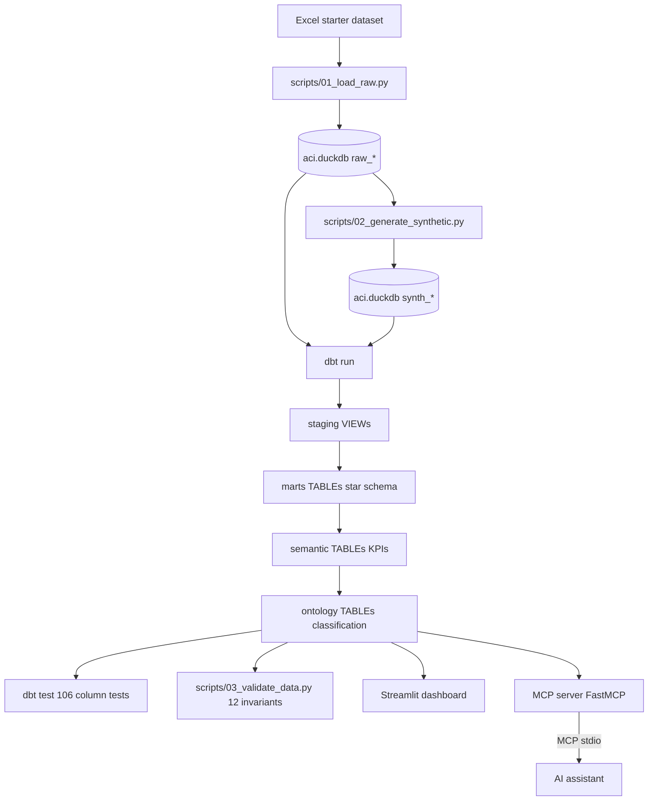
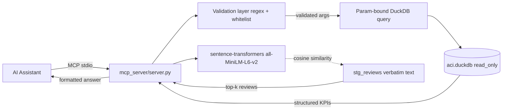

# Architecture & Design Decisions

## End-to-End Pipeline



> dbt model files (`dbt_project/models/*.sql`) are the single source of truth, executed by standard `dbt run`. `dbt test` runs the 106 column tests declared in `models/**/schema.yml`. System-level invariants run separately via `scripts/03_validate_data.py`.

---

## MCP Server Architecture



---

## Stack Choice

| Component | Tool | Why |
|-----------|------|-----|
| Warehouse | DuckDB | Zero-infrastructure, OLAP-optimised, single-file portability. |
| Transformation | dbt-core + dbt-duckdb | Industry-standard SQL transformation framework. The pipeline runs unmodified `dbt run` / `dbt test` / `dbt docs generate`. |
| Quality | `dbt test` (column tests) + Python validator (system invariants) | 106 schema-level tests via dbt + 12 cross-layer invariants via [scripts/03_validate_data.py](../scripts/03_validate_data.py). |
| Dashboard | Streamlit + Plotly | Single Python file, interactive, no server setup. |
| AI Layer | MCP (FastMCP) + sentence-transformers | Matches the brief. Structured queries + semantic review search through a typed tool interface. |

> **Python version:** `dbt-duckdb` supports Python 3.9–3.12. Python 3.13/3.14 is not yet supported by the adapter — pin to 3.12 in the project venv.

---

## REFERENCE_DATE — Frozen Analytical Clock

The starter data is January 2025 only. If derivations like `tenure_months` and `days_since_last_booking` were anchored to `CURRENT_DATE`, every customer would silently drift into "Dormant" status as the calendar advanced — masking the real signal.

The fix is a single project-wide constant declared in `dbt_project.yml`:

```yaml
vars:
  reference_date: "2025-02-01"
  value_tier_high_threshold: 17000
  value_tier_mid_threshold:  13000
```

`aci_config.py` reads these vars at import time, so Python scripts and dbt always see the same values. To change a threshold, edit `dbt_project.yml` — never duplicate it in Python.

[scripts/03_validate_data.py](../scripts/03_validate_data.py) asserts that `tenure_months` for a sample customer matches `date_diff('month', signup_date, reference_date)`. If someone reverts to `CURRENT_DATE` by mistake, the validation fails immediately.

---

## Modeling Philosophy

### Why Star Schema (not Data Vault)?

The decision question is oriented toward **executive analytics** — route profitability, customer retention, upsell. Star schema is optimal here because:

1. **Query simplicity** — Streamlit and MCP can read pre-aggregated semantic tables without join gymnastics.
2. **Dashboard performance** — semantic tables are < 1 MB, render instantly.
3. **Readable for business users** — `fact_flight.load_factor_pct` is self-explanatory; Data Vault link/satellite patterns are not.

Data Vault would only pay off if we needed historisation of KPI definitions over time or had multiple source systems with conflicting keys. Neither applies.

---

## Semantic Layer

The `sem_*` tables hold the **canonical KPI definitions**. Every downstream consumer (Streamlit, MCP, ad-hoc analysts) reads from them, never from raw bookings. A single change of the margin formula propagates everywhere via dbt's lineage.

Thresholds that drive segments are dbt variables, not hard-coded values:

```yaml
vars:
  value_tier_high_threshold: 17000   # p80 of customer revenue distribution
  value_tier_mid_threshold:  13000   # p33 of customer revenue distribution
```

This lets analysts re-tune segment boundaries without editing SQL.

---

## Ontology Layer — Inference Beyond Query Translation

The `ont_*` tables encode reasoning rules of the form:

```
IF margin_pct ≥ 50 AND delay_rate_pct < 10 AND cancellation_rate_pct < 5
THEN class = "Strategic Growth" AND recommendation = "Invest: expand frequency"
```

Each row carries:

- The **class** (mutually exclusive enum)
- The **recommendation** (parallel free-text action)
- A **confidence score** (0–100) quantifying how much evidence supported the decision

This mirrors W3C OWL-style reasoning (classify by observed properties, infer class membership, derive action). In production these would live in SHACL or a reasoning engine; here they are SQL CASE expressions readable by any tool that speaks SQL — including the MCP server.

---

## Unstructured Data Integration

Two unstructured sources, each with two parallel paths:

### `stg_reviews`

- **Structured**: `nps_score → promoter/passive/detractor → route_nps in sem_route_performance`
- **Unstructured**: `review_text` indexed by `sentence-transformers/all-MiniLM-L6-v2` in the MCP `search_reviews` tool — cosine similarity search for paraphrases, synonyms, concept matches.

### `stg_support_tickets`

- **Structured**: `category + csat → support_ticket_count, avg_support_csat in sem_route_performance`
- **Unstructured**: `description` surfaced via `get_complaint_themes` (top sample per category) and `compare_routes` (top 2 themes per route).

**Correlation guarantee.** The synthetic ticket generator weights route assignment by each route's delay + cancellation rate. R001's 30% delay rate drives the highest "Flight Delay" ticket count; R005's 8% cancellation rate drives the highest "Refund" ticket count. `scripts/03_validate_data.py` enforces a Spearman rank correlation ≥ 0.3 between operational stress and ticket volume (currently ≈ 0.83).

---

## MCP Server — Security & Robustness

The MCP server (`mcp_server/server.py`) is hardened for the agent setting:

- **Parameterised queries everywhere** — DuckDB `?` placeholders, no f-string interpolation of user input.
- **Whitelist validation** for every enum-shaped argument (`route_id`, `customer_class`, `value_tier`, `sentiment`, `category`).
- **Regex validation** on `route_id` (`^R\d{3}$`).
- **`limit` clamped** to 1–200 to prevent unbounded queries.
- **`@safe_tool` decorator** catches `ValidationError`, `duckdb.Error`, and unexpected exceptions, returning clean MCP messages.
- **Shared lazy connection** — DuckDB read-only connection opened once, reused across tools.
- **Lazy embedding index** — the 80 MB sentence-transformer model and 1.7K review vectors load on first `search_reviews` call, not at server start.

A red-team string like `route_id="R001' OR '1'='1"` is rejected at validation before any SQL runs.

---

## Quality Gates

Two complementary suites, both enforced before any change ships:

| Suite | What it checks | Run command |
|---|---|---|
| dbt column tests (106) | not_null, unique, accepted_values, relationships per column | `cd dbt_project; dbt test --profiles-dir .` |
| System-level data quality (12) | revenue conservation across layers, business-rule bounds, ticket/ops correlation, reference-date freeze | `python scripts/03_validate_data.py` |

Both exit non-zero on failure so they can wire into CI directly.

---

## Trade-offs & Known Limitations

| Trade-off | Decision | Rationale |
|-----------|----------|-----------|
| dbt vs raw SQL | dbt-core + dbt-duckdb | Industry standard, dependency graph + tests + auto-docs for free |
| Python 3.12 vs 3.14 | 3.12 (pinned in venv) | dbt-duckdb supports 3.9–3.12 only as of this writing |
| Streamlit vs Superset | Streamlit | Zero server setup, faster delivery, interactive Python charts |
| Rule-based ontology vs ML | Rule-based CASE expressions | Interpretable, auditable, no training data required |
| stdio MCP vs SSE | stdio | Simpler for local demo; SSE needed for production cloud deployment |
| Template reviews vs LLM-generated | Template + route issue suffix | Cheap, reproducible, sufficient for embedding search; LLM generation is the next step for richer language diversity |
