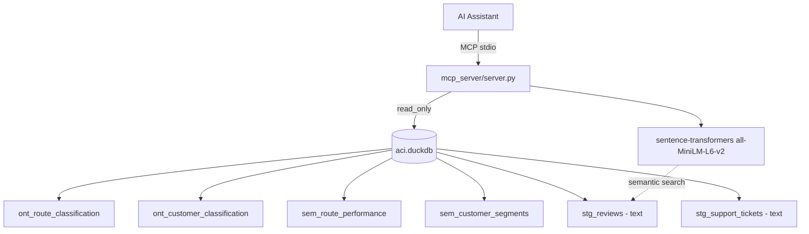

# Capture Guide — Screenshots & Video Walkthroughs

The brief requires visual deliverables (screenshots, live link, or video) for the dashboard and a short video for the MCP interaction. This guide produces both.

---

## Part 3 — Dashboard Screenshots

### One-time setup

```powershell
cd "c:\Analytic Engineer\air-cote-divoire"
python -m streamlit run dashboard/app.py --server.port 8501
```

Open <http://localhost:8501> in Chrome or Edge at **1440×900** (DevTools → device toolbar → custom 1440×900) for consistent screenshots.

### Capture checklist — save into `docs/screenshots/`

| File | Page | What to highlight |
|---|---|---|
| `01_network.png` | Network & Profitability | The route opportunity matrix (margin vs delay bubble chart) — annotate R001 (Operational Risk) and R009 (Cash Cow) |
| `02_network_yield.png` | Network & Profitability | Yield by route chart + competitive pricing chart side-by-side |
| `03_customer.png` | Customer & Retention | KPI cards + Customer class pie + Loyalty tier scatter |
| `04_customer_atrisk.png` | Customer & Retention | The 11-row High-Value At-Risk table at the bottom |
| `05_upsell.png` | Upsell & Cross-sell | Ancillary revenue stacked bar + Upsell Propensity by Segment |
| `06_decision.png` | Decision Layer | Investment Priority Matrix (bubble chart with categories) |
| `07_decision_recs.png` | Decision Layer | The 3 recommendation cards in a single screenshot |
| `08_decision_budget.png` | Decision Layer | Budget allocation pie + table side-by-side |

> **Quality:** use the browser's built-in Full Page Screenshot (Chrome DevTools → Cmd+Shift+P → "full page") rather than a window grab — Streamlit charts are rendered cleanly that way.

### Embed into README

Once screenshots are saved, reference them in [README.md](../README.md) under the "Dashboard" section:

```markdown


```

---

## Part 4 — MCP Video Walkthrough (~3 minutes)

### One-time setup

Configure your MCP client (Claude Desktop is the simplest). Add the server entry from `mcp_server/mcp_config.json` to:

- macOS: `~/Library/Application Support/Claude/claude_desktop_config.json`
- Windows: `%APPDATA%\Claude\claude_desktop_config.json`

Restart Claude Desktop. You should see "aci-analytics" in the tools menu (🔌 icon).

### Recording

Use **OBS Studio** (free) or **Windows Game Bar (Win+G)** on Windows / **Cmd+Shift+5** on macOS for screen recording. Target 1080p, 30fps, voice-over optional but encouraged.

### Suggested script (~180 seconds)

| Sec | What you say | What appears on screen |
|---|---|---|
| 0–15 | "This is the ACI Analytics MCP server. It exposes 9 tools that combine structured KPIs with unstructured review and complaint data." | Show Claude with the 🔌 indicator listing `aci-analytics` tools |
| 15–40 | "Let's start with the network shape." Type: *What does the network look like and which routes deserve more budget?* | Claude calls `get_network_summary` then `get_budget_recommendation` |
| 40–80 | "We see R001 flagged as Operational Risk. Let's drill in." Type: *Compare R001 to R009 — which complaints are driving the difference?* | Claude calls `compare_routes('R001','R009')` — table + complaint samples appear |
| 80–110 | "Now let's see the unstructured evidence directly." Type: *Find reviews that mention long delays in the morning* | Claude calls `search_reviews('long delays in the morning')` — semantic similarity hits appear |
| 110–140 | "On the customer side, who do we need to keep?" Type: *Which high-value customers are at risk and what should we offer them?* | Claude calls `get_at_risk_customers('High-Value At-Risk', limit=5)` |
| 140–180 | "Wrap-up: synthesise the budget" Type: *Synthesise a one-paragraph recommendation for the CEO* | Claude composes a grounded answer citing both routes and customer data |

### Save the video

Save as `docs/videos/mcp_walkthrough.mp4` (or upload to YouTube/Loom and paste the link into [README.md](../README.md) under "MCP demo").

---

## Part 4 — Architecture diagram

A static architecture diagram is already documented in [modeling_diagram.md](modeling_diagram.md). For a visual export, paste the block below into <https://mermaid.live> and download the PNG/SVG.



Export and save as `docs/screenshots/architecture.png`.

---

## Final delivery checklist

- [ ] 8 dashboard screenshots in `docs/screenshots/`
- [ ] 1 MCP walkthrough video in `docs/videos/` OR linked from README
- [ ] 1 architecture diagram in `docs/screenshots/architecture.png` (optional but recommended)
- [ ] README links to screenshots and video
