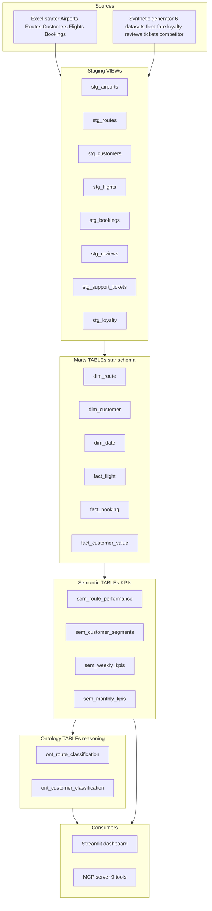
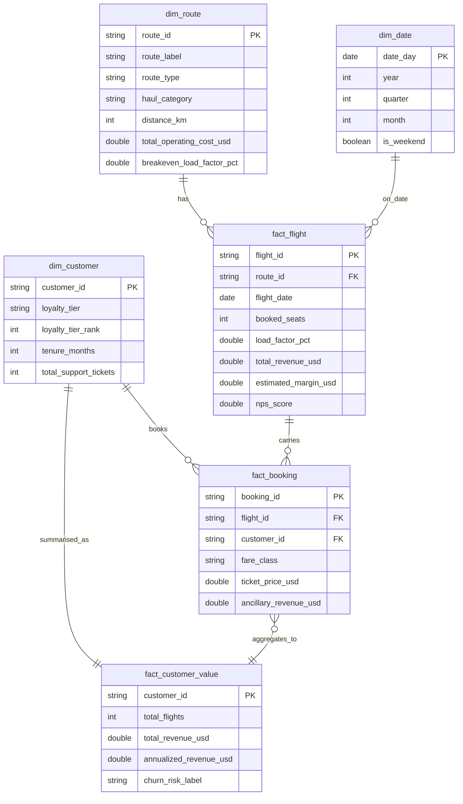
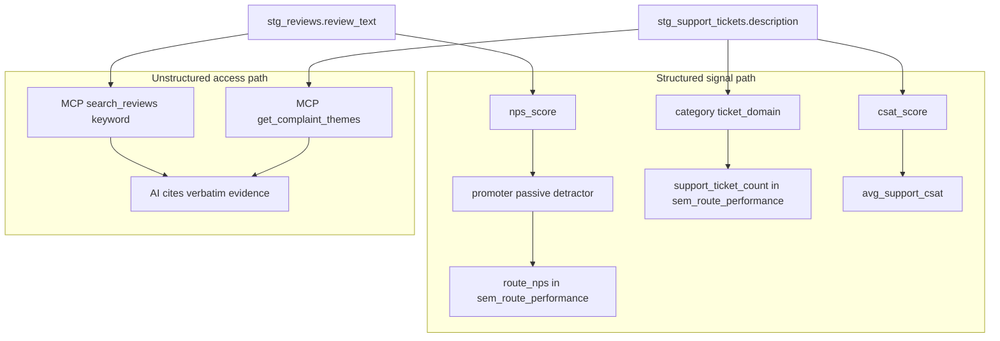

# Modeling Diagram — Air Côte d'Ivoire Analytics

## Data Flow Architecture

```
┌─────────────────────────────────────────────────────────────────────────┐
│                         SOURCE LAYER                                    │
│                                                                         │
│  Excel Starter Dataset          Synthetic Enrichment                    │
│  ├── Airports   (10 rows)       ├── aircraft_fleet   (12 rows)         │
│  ├── Routes     (12 rows)       ├── fare_details     (12 rows)         │
│  ├── Customers  (300 rows)      ├── loyalty_activity (~2,100 rows)     │
│  ├── Flights    (480 rows)      ├── customer_reviews (~1,700 rows) ✱   │
│  └── Bookings   (11,475 rows)   ├── support_tickets  (1,500 rows) ✱   │
│                                 └── competitor_context (264 rows)       │
│                                              ✱ = unstructured text      │
└──────────────────────────────┬──────────────────────────────────────────┘
                               │  scripts/01_load_raw.py
                               │  scripts/02_generate_synthetic.py
                               ▼
┌─────────────────────────────────────────────────────────────────────────┐
│                         STAGING LAYER  (VIEWs)                         │
│                                                                         │
│  stg_airports   stg_routes   stg_customers   stg_flights   stg_bookings│
│  stg_reviews    stg_support_tickets   stg_loyalty                      │
│                                                                         │
│  → Clean types, derived fields, delay_category, nps_category, etc.    │
└──────────────────────────────┬──────────────────────────────────────────┘
                               │  dbt run --profiles-dir .
                               ▼
┌─────────────────────────────────────────────────────────────────────────┐
│                    MARTS LAYER — Star Schema  (TABLEs)                 │
│                                                                         │
│  ┌─────────────┐    ┌──────────────────┐    ┌─────────────────────┐   │
│  │  dim_route  │    │   fact_flight    │    │    dim_customer     │   │
│  │─────────────│◄───│──────────────────│───►│─────────────────────│   │
│  │route_id  PK │    │flight_id      PK │    │customer_id       PK │   │
│  │route_label  │    │route_id       FK │    │loyalty_tier         │   │
│  │haul_category│    │booked_seats      │    │tenure_months        │   │
│  │distance_km  │    │load_factor_pct   │    │total_points_earned  │   │
│  │op_cost_usd  │    │total_revenue_usd │    │total_support_tickets│   │
│  │breakeven_lf │    │estimated_margin  │    └─────────────────────┘   │
│  │seat_capacity│    │nps_score         │                               │
│  └─────────────┘    │delay_category    │    ┌─────────────────────┐   │
│                     └──────────────────┘    │   fact_booking      │   │
│  ┌─────────────┐           │                │─────────────────────│   │
│  │  dim_date   │           │                │booking_id        PK │   │
│  │─────────────│           ▼                │flight_id         FK │   │
│  │date_key  PK │    ┌──────────────────┐    │customer_id       FK │   │
│  │year/quarter │    │fact_customer_val │    │fare_class           │   │
│  │month_name   │    │──────────────────│    │revenue_per_pax_usd  │   │
│  │is_weekend   │    │customer_id    PK │    │has_ancillary        │   │
│  └─────────────┘    │total_flights     │    └─────────────────────┘   │
│                     │total_revenue_usd │                               │
│                     │annualized_clv    │                               │
│                     │churn_risk_label  │                               │
│                     └──────────────────┘                               │
└──────────────────────────────┬──────────────────────────────────────────┘
                               │
                               ▼
┌─────────────────────────────────────────────────────────────────────────┐
│                    SEMANTIC LAYER  (TABLEs)                             │
│                                                                         │
│  sem_route_performance          sem_customer_segments                  │
│  ─────────────────────          ──────────────────────                 │
│  43 KPIs per route              Per-customer derived attributes        │
│  • total_revenue_usd            • value_tier (High/Mid/Low)            │
│  • margin_pct                   • upsell_propensity                    │
│  • avg_load_factor_pct          • retention_action                     │
│  • yield_cents_per_pax_km       • churn_risk_label                     │
│  • route_nps                    • ancillary_attach_rate_pct            │
│  • delay_rate_pct               • premium_conversion_rate_pct          │
│  • avg_price_gap (vs comp)                                              │
│  • support_ticket_count         sem_weekly_kpis                        │
│  • breakeven_load_factor_pct    ─────────────────                      │
│                                 Weekly ops trends (60 rows)            │
└──────────────────────────────┬──────────────────────────────────────────┘
                               │
                               ▼
┌─────────────────────────────────────────────────────────────────────────┐
│                    ONTOLOGY LAYER  (TABLEs)                             │
│                                                                         │
│  ont_route_classification            ont_customer_classification       │
│  ──────────────────────────          ───────────────────────────       │
│  Input: sem_route_performance        Input: sem_customer_segments      │
│                                                                         │
│  Rules (CASE expressions):           Rules (CASE expressions):         │
│  margin ≥50% ∧ delay <10%           value=High ∧ flights <36          │
│    → "Strategic Growth"               → "High-Value At-Risk"           │
│  margin ≥40% ∧ delay <20%           tier_rank ≥3 ∧ flights ≥39       │
│    → "Cash Cow"                       → "Loyal Advocate"               │
│  margin ≥40% ∧ delay ≥20%           value=Mid/High ∧ propensity=High  │
│    → "Operational Risk"               → "Growth Target"                │
│  margin <25%                         flights <20                        │
│    → "Underperforming"                → "Dormant"                      │
│                                                                         │
│  Output: route_class +               Output: customer_class +          │
│          budget_recommendation               recommended_action +      │
│          confidence_pct                      ltv_potential_score       │
└──────────────────────────────┬──────────────────────────────────────────┘
                               │
                    ┌──────────┴──────────┐
                    ▼                     ▼
         ┌──────────────────┐   ┌──────────────────────┐
         │  Streamlit       │   │  MCP Server          │
         │  Dashboard       │   │  (Python FastMCP)    │
         │──────────────────│   │──────────────────────│
         │ Page 1: Network  │   │ get_network_summary  │
         │ Page 2: Customer │   │ get_route_performance│
         │ Page 3: Upsell   │   │ get_at_risk_customers│
         │ Page 4: Decision │   │ get_complaint_themes │
         └──────────────────┘   │ compare_routes       │
                                │ search_reviews ✱     │
                                │ get_budget_recommend │
                                └──────────────────────┘
```

---

## Layered Data Flow (Mermaid)

> Paste into <https://mermaid.live> for export to PNG/SVG.



---

## Entity-Relationship Diagram (Mermaid erDiagram)

> Native Mermaid ER syntax. Renders cleanly on GitHub and mermaid.live.



---

## Entity-Relationship Diagram (Star Schema Core)

```
                    ┌─────────────────┐
                    │    dim_date     │
                    │─────────────────│
                    │ date_key     PK │
                    │ date_day        │
                    │ year/month/qtr  │
                    │ is_weekend      │
                    └────────┬────────┘
                             │ (flight_date)
                             │
┌──────────────┐    ┌────────▼────────┐    ┌─────────────────┐
│  dim_route   │    │   fact_flight   │    │  dim_customer   │
│──────────────│    │─────────────────│    │─────────────────│
│ route_id  PK │◄───│ flight_id    PK │    │ customer_id  PK │
│ route_label  │    │ route_id     FK │    │ full_name       │
│ route_type   │    │ flight_date  FK │    │ loyalty_tier    │
│ haul_cat     │    │ booked_seats    │    │ customer_segment│
│ distance_km  │    │ load_factor_pct │    │ tenure_months   │
│ op_cost_usd  │    │ revenue_usd     │    │ points_earned   │
│ breakeven_lf │    │ margin_usd      │    └────────┬────────┘
│ seat_capacity│    │ nps_score       │             │
│ fuel_cost    │    │ delay_min       │             │ (customer_id)
│ competitor_px│    │ delay_category  │    ┌────────▼────────┐
└──────────────┘    └─────────────────┘    │  fact_booking   │
                             ▲             │─────────────────│
                             │ (flight_id) │ booking_id   PK │
                             └─────────────│ flight_id    FK │
                                           │ customer_id  FK │
                                           │ fare_class      │
                                           │ ticket_price    │
                                           │ ancillary_rev   │
                                           │ has_ancillary   │
                                           └─────────────────┘
                                                    │
                                           ┌────────▼────────┐
                                           │fact_customer_val│
                                           │─────────────────│
                                           │customer_id   PK │
                                           │total_flights    │
                                           │total_revenue    │
                                           │annualized_clv   │
                                           │ancillary_rate   │
                                           │premium_conv_rate│
                                           └─────────────────┘
```

---

## Unstructured Data Integration

```
                  Verbatim Text Sources
                  ┌─────────────────────────────┐
                  │ stg_reviews.review_text      │
                  │ stg_support_tickets          │
                  │         .description         │
                  └──────────────┬──────────────┘
                                 │
                   ┌─────────────┴─────────────┐
                   ▼                           ▼
         Structured Signals              Raw Text Access
         ──────────────────              ─────────────────
         nps_score → promoter/          MCP search_reviews(keyword)
           passive/detractor            MCP get_complaint_themes()
         → route_nps in                 → AI can cite verbatim
           sem_route_performance         evidence in answers

         category → ticket_domain
         → support_ticket_count
           in sem_route_performance

         csat_score → avg_support_csat
```

### Unstructured Integration (Mermaid)



---

## Layer Summary

| Layer | Tables | Grain | Purpose |
|-------|--------|-------|---------|
| Staging | 8 VIEWs | Same as source | Clean types, derived fields, null handling |
| Marts | 5 TABLEs | Flight / Booking / Customer | Star schema — joins and aggregations |
| Semantic | 4 TABLEs | Route / Customer / Week | Business KPI definitions (single source of truth) |
| Ontology | 2 TABLEs | Route / Customer | Classification rules → actionable labels |
